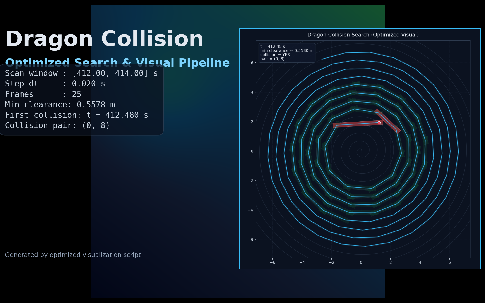
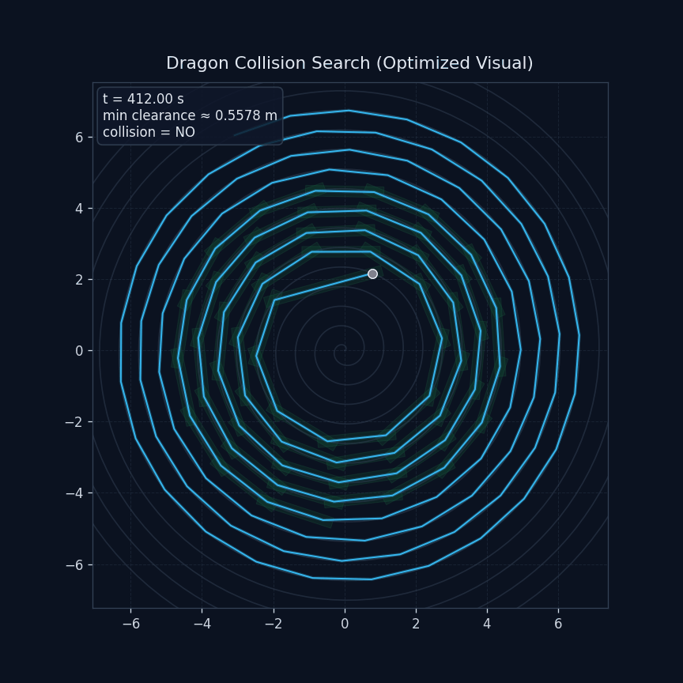
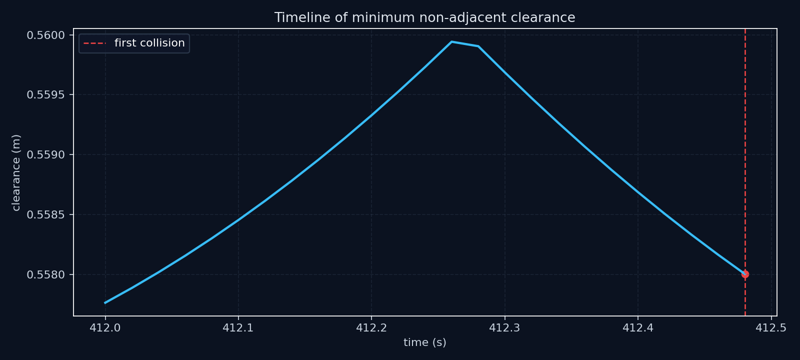
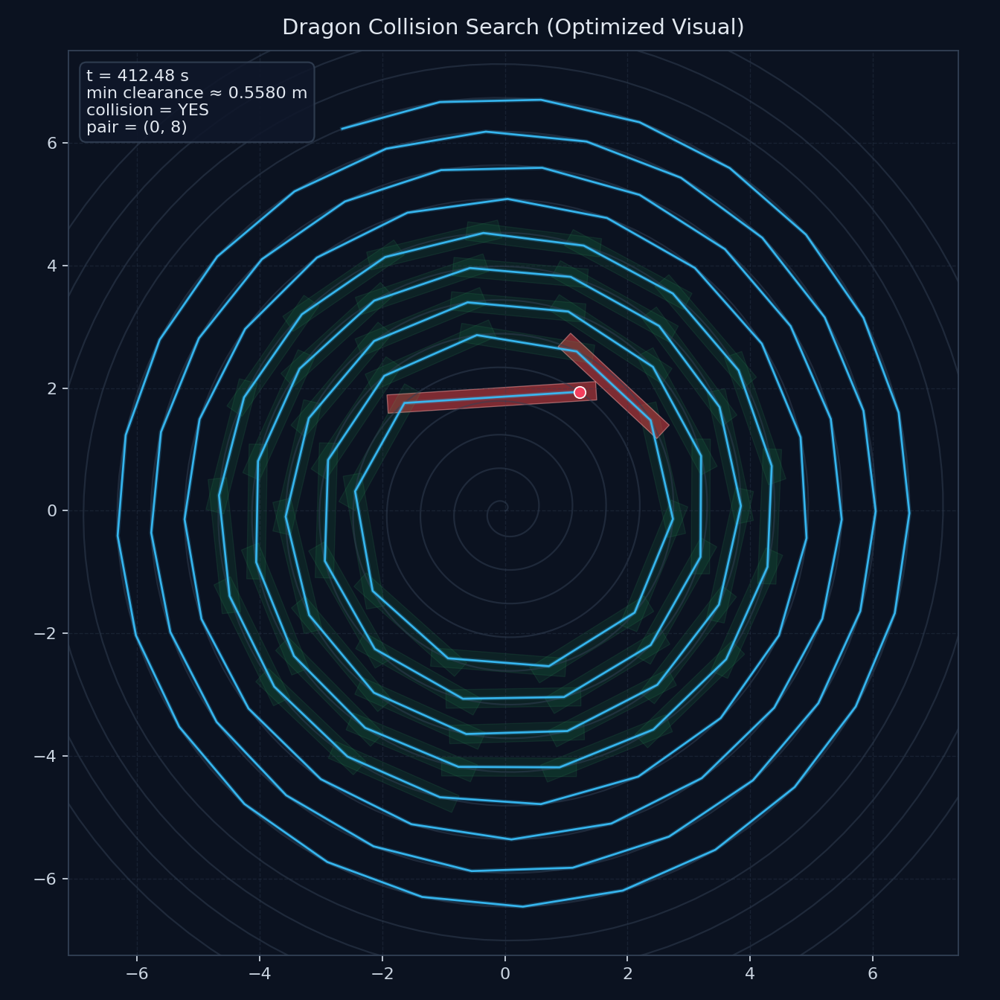

<div align="center">

# Dragon Collision Visualization

一次运行，自动输出碰撞结论 + 高质量图像 + 动态回放 + 交互式 Dashboard。


</div>



## 一键跳转

| 入口 | 说明 |
| --- | --- |
| [项目首页](../../README.md) | GitHub 首页展示入口 |
| [论文目录](../../1-paper/README.md) | 论文与赛题文档索引 |
| [论文提交版 PDF](../../1-paper/24年数模国赛论文.pdf) | 对外展示的核心文档 |
| [赛题原文 PDF](../../1-paper/A题.pdf) | 题意与约束来源 |
| [代码讲解](../../代码讲解.md) | 各脚本逐文件说明 |
| [可视化产物说明](viz_output/README.md) | 图像/GIF/表格/JSON 说明 |
| [交互式 Dashboard](viz_output/collision_dashboard.html) | 轨迹回放与时间线联动 |
| [结构化摘要 JSON](viz_output/summary.json) | 可直接引用到论文/答辩 |

## Highlights

- 碰撞检测：AABB 粗筛 + SAT 精判，速度与准确性兼顾。
- 展示输出：封面海报、时间线、关键帧、GIF、Dashboard 一次导出。
- GitHub 友好：推送仓库后主页可直接展示核心结果。

## Quick Start

```bash
python 第二问_优化可视化展示.py
```

> 如果你要刷新项目首页展示素材，运行后把 `viz_output/` 中产物直接推送到 GitHub 即可。

## Core Results

- 首次碰撞时间：412.480 s
- 碰撞板凳对：(0, 8)
- 扫描帧数：25
- 时间步长 dt：0.02

## Gallery

### Process Animation


### Clearance Timeline


### Collision Key Frame


## Interactive Dashboard

- 本地文件：[viz_output/collision_dashboard.html](viz_output/collision_dashboard.html)
- 建议开启 GitHub Pages 后在线预览该 HTML。

## Data Outputs

- 指标表 CSV：[viz_output/collision_metrics.csv](viz_output/collision_metrics.csv)
- 结构化摘要 JSON：[viz_output/summary.json](viz_output/summary.json)
