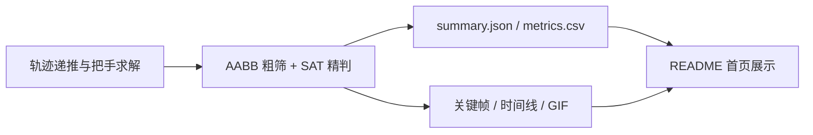

# 2024 国赛参赛项目（A题）

<div align="center">

从建模、求解到展示一体化输出：<b>不跑代码，也能在首页看懂结果</b>。


</div>


## 首页动态展示


## 一键直达（论文 + 结果 + 代码）

| 入口 | 作用 |
| --- | --- |
| [论文提交版](1-paper/24年数模国赛论文.pdf) | 对外展示核心成果 |
| [赛题原文](1-paper/A题.pdf) | 评审快速核对题意 |
| [项目代码讲解](代码讲解.md) | 各脚本逐文件说明 |
| [代码总览](2-code/README.md) | 正式代码 / 脚本 / 试验分区导航 |
| [第二问高级可视化说明](2-code/正式代码/README_第二问高级可视化.md) | 展示模板与可视化说明 |
| [交互式 Dashboard](2-code/正式代码/viz_output/collision_dashboard.html) | 轨迹回放 + 时间线联动 |
| [结构化摘要 JSON](2-code/正式代码/viz_output/summary.json) | 首次碰撞时刻、碰撞节段对、参数 |
| [逐帧指标 CSV](2-code/正式代码/viz_output/collision_metrics.csv) | 结果表格化二次分析 |

## 结果速览

| 指标 | 数值 |
| --- | --- |
| 扫描区间 | 412.0 ~ 414.0 s |
| 时间步长 | 0.02 s |
| 首次碰撞时刻 | 412.48 s |
| 碰撞节段对 | (0, 8) |
| 扫描帧数 | 25 |

## 模块导航

- [1-paper/README.md](1-paper/README.md)：论文与赛题文档索引。
- [2-code/README.md](2-code/README.md)：代码目录分区与复现路线。
- [2-code/正式代码/README.md](2-code/正式代码/README.md)：最终可复现实验入口。
- [2-code/正式代码/viz_output/README.md](2-code/正式代码/viz_output/README.md)：图像、GIF、Dashboard、CSV、JSON 说明。
- [2-code/script/README.md](2-code/script/README.md)：过程脚本与中间验证脚本。
- [2-code/试验/README.md](2-code/试验/README.md)：碰撞算法原型实验。
- [图片/README.md](图片/README.md)：论文/展示图像资源规范。

## 快速复现

在 `2-code/正式代码` 目录运行：

```bash
python 第二问_优化可视化展示.py
```

## 可视化流程


